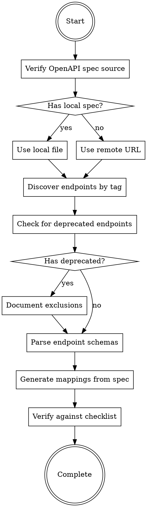

# Creating WireMock Mappings for Smartsheet SDK

## Overview

Generate comprehensive WireMock mapping files for Smartsheet API endpoints based on OpenAPI specifications. This skill ensures systematic endpoint discovery, deprecated endpoint exclusion, and accurate schema-based mock generation.

**Core principle:** Never guess API schemas. Always derive mappings from OpenAPI specification.

## When to Use

Use this skill when:
- Creating WireMock mappings for Smartsheet SDK tests
- Adding test coverage for new Smartsheet API endpoints
- Working with endpoint groups (users, workspaces, sheets, etc.)
- User provides local or remote OpenAPI specification
- Generating mock API responses for testing

**Do NOT use for:**
- Reviewing existing mappings (use `review-wiremock-mappings` skill)
- Non-Smartsheet API mocking
- Manual API testing without SDK context

## Required Inputs

**User MUST provide:**
- Endpoint group name (e.g., "users", "workspaces", "contacts")
- OpenAPI specification source:
  - Remote URL: `https://developers.smartsheet.com/_spec/api/smartsheet/openapi.json`
  - Local file path: e.g., `./specs/contacts-openapi.json`

**Additional references:**
- [CONTRIBUTING.md](../../../CONTRIBUTING.md) - WireMock mapping conventions
- Project-specific test patterns and examples

## Workflow



## Step-by-Step Process

### 1. Verify OpenAPI Specification Source

**If user provides local file path:**
```bash
# Verify file exists
ls -la ./specs/contacts-openapi.json

# Use this file for all subsequent queries
SPEC_SOURCE="./specs/contacts-openapi.json"
```

**If no local file specified:**
```bash
# Use published Smartsheet OpenAPI spec
SPEC_SOURCE="https://developers.smartsheet.com/_spec/api/smartsheet/openapi.json"
```

**CRITICAL:** Never proceed without confirming spec source exists and is accessible.

### 2. Discover All Endpoints in Group

Find the tag name for the endpoint group, then discover all endpoints:

```bash
# List all available tags to find the correct one
jq '.tags[] | .name' "$SPEC_SOURCE"

# Discover all endpoints with specific tag (e.g., "contacts")
jq '.paths | to_entries |
    map(select(.value | to_entries[] |
        select(.key != "parameters") |
        .value.tags[]? == "contacts")) |
    map({path: .key, methods: (.value | to_entries |
        map(select(.key != "parameters") | .key))})' "$SPEC_SOURCE"
```

**Common tag mappings:**
- `"users"` → Users group
- `"webhooks"` → Webhooks group
- `"sharing"` → Sharing group
- `"workspaces"` → Workspaces group
- `"sheets"` → Sheets group

### 3. Check for Deprecated Endpoints

**CRITICAL RULE:** Never create mappings for deprecated endpoints.

```bash
# Check deprecation status for discovered endpoints
# Replace "/contacts" with your endpoint path prefix
jq '.paths | to_entries |
    map(select(.key | startswith("/contacts"))) |
    map({path: .key, methods: (.value | to_entries |
        map(select(.key != "parameters") |
            {method: .key, deprecated: (.value.deprecated // false)}))})' "$SPEC_SOURCE"

# List ONLY deprecated endpoints
jq '.paths | to_entries |
    map(select(.key | startswith("/contacts"))) |
    map({path: .key, methods: (.value | to_entries |
        map(select(.key != "parameters") |
            {method: .key, deprecated: .value.deprecated}) |
        map(select(.deprecated == true)))}) |
    map(select(.methods | length > 0))' "$SPEC_SOURCE"
```

**If deprecated endpoints found:**
- Document them explicitly in spec/README
- Explain why excluded (deprecated, replaced by X)
- Do NOT create mappings for them

### 4. Parse Endpoint Schemas

For each non-deprecated endpoint, extract:
- HTTP method
- Path template
- Request schema (if applicable)
- Response schema (required vs optional properties)
- Status codes

```bash
# Get complete schema for specific endpoint
jq '.paths["/contacts/{contactId}"].get' "$SPEC_SOURCE"

# Extract response schema
jq '.paths["/contacts/{contactId}"].get.responses["200"].content["application/json"].schema' "$SPEC_SOURCE"
```

### 5. Generate Mappings from Schema

For each endpoint, create mappings following CONTRIBUTING.md conventions:

**Mapping structure:**
- Directory: `mappings/{group}/{endpoint-name}/`
- Files: One per test case
- Naming: `{Group} - {Operation} {Case}.json`

**CRITICAL: Endpoint Naming Rules (Based on Path Structure)**

The `{endpoint-name}` MUST follow REST conventions based on path structure, NOT the OpenAPI summary field:

| Path Pattern | HTTP Method | Naming Rule | Example |
|--------------|-------------|-------------|---------|
| `/{resource}` | GET | `list-{resource}` | `/reports` → `list-reports` |
| `/{resource}/{id}` | GET | `get-{resource}` | `/reports/{reportId}` → `get-report` |
| `/{parent}/{id}/{children}` | GET | `list-{parent}-{children}` | `/reports/{reportId}/columns` → `list-report-columns` |
| `/{parent}/{id}/{children}/{childId}` | GET | `get-{parent}-{child}` | `/reports/{reportId}/columns/{columnId}` → `get-report-column` |
| `/{resource}` | POST | `create-{resource}` | `/reports` → `create-report` |
| `/{parent}/{id}/{children}` | POST | `create-{parent}-{children}` | `/reports/{reportId}/columns` → `create-report-columns` |
| `/{resource}/{id}` | PUT | `update-{resource}` | `/reports/{reportId}` → `update-report` |
| `/{parent}/{id}/{children}/{childId}` | PUT | `update-{parent}-{child}` | `/reports/{reportId}/columns/{columnId}` → `update-report-column` |
| `/{resource}/{id}` | DELETE | `delete-{resource}` | `/reports/{reportId}` → `delete-report` |
| `/{parent}/{id}/{children}/{childId}` | DELETE | `delete-{parent}-{child}` | `/reports/{reportId}/columns/{columnId}` → `delete-report-column` |

**Why path structure, not summary?**
- OpenAPI summary fields can be incorrect or inconsistent
- Path structure is authoritative: ID in final segment = single resource operation
- REST convention: Collection endpoints (no ID) return lists, resource endpoints (with ID) return single items

**WRONG Examples (trusting misleading summary):**
- ❌ Summary says "Get report columns" → naming it `get-report-columns`
  - Path is `/reports/{reportId}/columns` (no column ID) → Should be `list-report-columns`

**CORRECT Examples (using path structure):**
- ✅ `/reports/{reportId}/columns` GET → `list-report-columns` (collection endpoint)
- ✅ `/reports/{reportId}/columns/{columnId}` GET → `get-report-column` (single resource endpoint)

**Standard test cases for GET/DELETE:**
1. `all-response-body-properties` - All properties from schema
2. `required-response-body-properties` - Only required properties

**Request matching (from CONTRIBUTING.md):**
```json
{
  "request": {
    "urlPathTemplate": "/2.0/contacts/{contactId}",
    "method": "GET",
    "headers": {
      "Authorization": {
        "matches": "Bearer .*"
      },
      "x-test-name": {
        "equalTo": "/contacts/get-contact/all-response-body-properties"
      },
      "x-request-id": {
        "matches": ".*"
      }
    }
  }
}
```

**CRITICAL:** Use exact property names, types, and structure from OpenAPI schema. Never guess or add fictional properties.

### 6. Verify Against Checklist

Before completing, verify using the [creation checklist](./checklist.md):
- [ ] OpenAPI spec source identified and accessible
- [ ] All endpoints in group discovered by tag
- [ ] Deprecated endpoints identified and excluded
- [ ] Response schemas match OpenAPI spec exactly
- [ ] CONTRIBUTING.md conventions followed
- [ ] Directory structure correct
- [ ] Test case naming consistent

## Common Mistakes

| Mistake | Fix |
|---------|-----|
| Naming based on OpenAPI summary instead of path structure | Use path structure rules: ID in final segment = get/update/delete, no ID = list/create |
| Trusting "Get X" summary for collection endpoints | `/parent/{id}/children` GET is always "list", never "get" |
| Guessing API schema properties | Always derive from OpenAPI spec |
| Creating mappings for single endpoint when tag has multiple | Use tag-based discovery to find all endpoints |
| Skipping deprecation check | Always check before creating mappings |
| Using remote spec when local provided | Respect user's spec source preference |
| Adding fictional properties (name, title, phoneNumber) | Only use properties defined in schema |
| Proceeding without verifying spec exists | Fail fast if spec unavailable |
| Missing required vs optional distinction | Parse schema to identify required fields |

## Red Flags - STOP and Verify

Stop if you find yourself:
- "The summary says 'Get X' so I'll name it get-x" (Check path structure first!)
- "I'll create basic mappings with common properties"
- "Without the spec, I cannot... but I'll proceed anyway"
- "This seems like a reasonable schema"
- Creating mappings before checking for deprecated endpoints
- Assuming only one endpoint exists in the group
- Using remote spec when local file was provided
- Naming endpoint without analyzing path structure for IDs

**All of these mean:** Go back to the workflow. Follow it systematically.

## Real-World Impact

**Before this skill:**
- Agents guessed schemas, creating inaccurate test fixtures
- Deprecated endpoints included in test suite
- Incomplete endpoint coverage (single endpoint when group had multiple)
- Tests passed against mocks but failed against real API

**After this skill:**
- Schema-accurate mappings derived from OpenAPI spec
- Deprecated endpoints systematically excluded
- Complete coverage of all group endpoints
- Reliable SDK tests that match production API behavior
