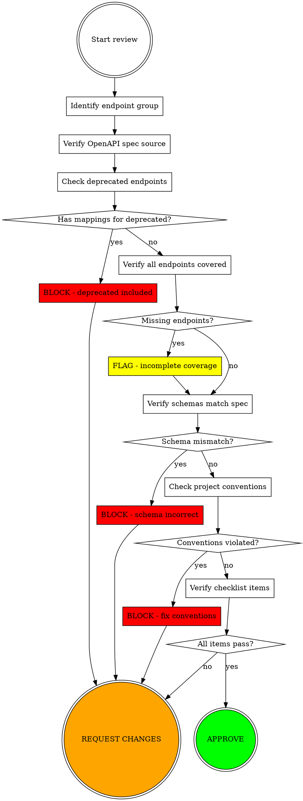

# Reviewing WireMock Mappings for Smartsheet SDK

## Overview

Systematically review WireMock mapping files for Smartsheet API endpoints to ensure they match OpenAPI specifications, exclude deprecated endpoints, and follow project conventions.

**Core principle:** Never approve mappings based on "looks reasonable". Always verify against OpenAPI spec and checklist.

## When to Use

Use this skill when:
- Reviewing pull requests with WireMock mappings
- Verifying mappings before merge
- Code review of colleague's mapping submissions
- Quality checking existing mappings
- User asks "can you review these mappings"

**Do NOT use for:**
- Creating new mappings (use `create-wiremock-mappings` skill)
- Non-Smartsheet API mocking
- Reviewing non-mapping code

## Required Context

**You need:**
- Endpoint group being reviewed (e.g., "workspaces", "users")
- Location of mapping files (e.g., `mappings/workspaces/`)
- OpenAPI specification source:
  - Remote: `https://developers.smartsheet.com/_spec/api/smartsheet/openapi.json`
  - Local: User-provided file path

**References:**
- [CONTRIBUTING.md](../../../CONTRIBUTING.md) - Project conventions
- [Creation checklist](../create-wiremock-mappings/checklist.md) - Verification criteria

## Review Workflow



## Step-by-Step Review Process

### 1. Identify Endpoint Group and Spec Source

Determine which endpoint group is being reviewed and locate the OpenAPI spec:

```bash
# If local spec path provided
SPEC_SOURCE="./specs/workspaces-openapi.json"

# Otherwise use published spec
SPEC_SOURCE="https://developers.smartsheet.com/_spec/api/smartsheet/openapi.json"
```

### 2. Check for Deprecated Endpoints (CRITICAL)

**BLOCKING ISSUE:** Mappings MUST NOT include deprecated endpoints.

```bash
# Check deprecation status for the endpoint group
# Replace "/workspaces" with your group's path prefix
jq '.paths | to_entries | 
    map(select(.key | startswith("/workspaces"))) |
    map({path: .key, methods: (.value | to_entries |
        map(select(.key != "parameters") | 
            {method: .key, deprecated: (.value.deprecated // false)}))})' "$SPEC_SOURCE"

# List ONLY deprecated endpoints
jq '.paths | to_entries | 
    map(select(.key | startswith("/workspaces"))) |
    map({path: .key, methods: (.value | to_entries |
        map(select(.key != "parameters") | 
            {method: .key, deprecated: .value.deprecated}) |
        map(select(.deprecated == true)))}) | 
    map(select(.methods | length > 0))' "$SPEC_SOURCE"
```

**If deprecated endpoints found:**
- Check if mappings exist for them in `mappings/{group}/`
- **BLOCK merge** if deprecated mappings present
- Require removal before approval

### 3. Verify Complete Endpoint Coverage

Discover all endpoints in the group by tag, then verify mappings exist:

```bash
# Find tag name for group (e.g., "workspaces")
jq '.tags[] | select(.name == "workspaces")' "$SPEC_SOURCE"

# List all endpoints with that tag
jq '.paths | to_entries | 
    map(select(.value | to_entries[] | 
        select(.key != "parameters") | 
        .value.tags[]? == "workspaces")) | 
    map({path: .key, methods: (.value | to_entries | 
        map(select(.key != "parameters") | .key))})' "$SPEC_SOURCE"
```

**Cross-reference with mapping directories:**
```bash
# List existing mapping directories
ls -la mappings/workspaces/
```

**FLAG if:**
- Endpoints in spec but no corresponding mapping directory
- This is NOT blocking (may be partial implementation)
- Document missing endpoints in review comments

### 4. Verify Schemas Match OpenAPI Spec

For each mapping file, compare response schema against spec:

```bash
# Get schema for specific endpoint
jq '.paths["/workspaces/{workspaceId}"].get.responses["200"].content["application/json"].schema' "$SPEC_SOURCE"
```

**Check:**
- Property names match exactly (no fictional properties)
- Property types match (string, number, boolean, object, array)
- Required vs optional properties correctly represented
- Enum values match (if applicable)
- Array item types match

**BLOCKING if:**
- Properties in mapping don't exist in spec
- Property types mismatch
- Required properties missing from "all-properties" variant

### 5. Verify Project Conventions (CONTRIBUTING.md)

Check each mapping file for:

**Request matching:**
- ✅ Uses `urlPathTemplate` (not hardcoded IDs)
- ✅ `Authorization` header: `{"matches": "Bearer .*"}`
- ✅ `x-test-name` header: `{"equalTo": "/group/endpoint/test-case"}`
- ✅ `x-request-id` header: `{"matches": ".*"}`
- ❌ NO request body matching
- ❌ NO query parameter matching

**Response structure:**
- ✅ `status`: 200 (or appropriate code)
- ✅ `statusMessage`: "OK"
- ✅ `jsonBody`: Object/array matching schema
- ✅ `headers`: `{"Content-Type": "application/json"}`

**Directory structure:**
- ✅ `mappings/{group}/{endpoint-name}/`
- ✅ File naming: `{Group} - {Operation} {Case}.json`

**Endpoint naming verification (CRITICAL):**

The `{endpoint-name}` MUST follow REST conventions based on **path structure**, NOT the OpenAPI summary field:

| Path Pattern | HTTP Method | Correct Name | Common Wrong Name |
|--------------|-------------|--------------|-------------------|
| `/{resource}` | GET | `list-{resource}` | ❌ `get-{resource}` |
| `/{resource}/{id}` | GET | `get-{resource}` | - |
| `/{resource}` | POST | `create-{resource}` | ❌ `add-{resource}` |
| `/{resource}/{id}` | PUT | `update-{resource}` | - |
| `/{resource}/{id}` | DELETE | `delete-{resource}` | - |
| `/{parent}/{id}/{children}` | GET | `list-{parent}-{children}` | ❌ `get-{parent}-{children}` |
| `/{parent}/{id}/{children}` | POST | `create-{parent}-{children}` | ❌ `add-{parent}-{children}` |
| `/{parent}/{id}/{children}/{childId}` | GET | `get-{parent}-{child}` | - |
| `/{parent}/{id}/{children}/{childId}` | PUT | `update-{parent}-{child}` | - |
| `/{parent}/{id}/{children}/{childId}` | DELETE | `delete-{parent}-{child}` | - |

**Rule:** ID in final path segment = get/update/delete (singular), no ID = list/create (plural)

**BLOCKING if:** Directory named based on misleading summary instead of path structure

**Test case coverage:**
- ✅ GET/DELETE endpoints have both:
  - `all-response-body-properties`
  - `required-response-body-properties`
- ✅ POST/PUT/PATCH endpoints have both variants

### 6. Verify Against Checklist

Use the [creation checklist](../create-wiremock-mappings/checklist.md) as verification criteria. Every checklist item should be verifiable from the mappings.

**Key checklist items:**
- [ ] OpenAPI spec source identified
- [ ] All endpoints in group covered (or documented exclusions)
- [ ] Deprecated endpoints excluded
- [ ] Response schemas match spec exactly
- [ ] No fictional properties
- [ ] Required vs optional properties correct
- [ ] CONTRIBUTING.md conventions followed
- [ ] Directory structure correct
- [ ] File naming consistent
- [ ] Standard test cases present

## Review Verdict Categories

### APPROVE ✅
All checks pass:
- No deprecated endpoints included
- Schemas match spec exactly
- Conventions followed
- Checklist verified

### REQUEST CHANGES (BLOCKING) 🚫
Critical issues found:
- Mappings for deprecated endpoints present
- Endpoint named based on summary instead of path structure
- Schema doesn't match OpenAPI spec
- Fictional properties added
- Required conventions violated

### REQUEST CHANGES (NON-BLOCKING) ⚠️
Minor issues or incomplete:
- Missing some endpoints in group (partial implementation)
- Missing test case variants
- Naming inconsistencies
- Minor convention deviations

### COMMENT (INFORMATIONAL) 💬
No changes needed, but note:
- Suggestions for future improvements
- Missing endpoints not yet implemented
- Clarifying questions

## Common Mistakes in Reviews

| Mistake | Fix |
|---------|-----|
| Not verifying endpoint naming against path structure | Check: ID in final segment = get/update/delete, no ID = list/create |
| Approving "get-X" naming for collection endpoints | `/parent/{id}/children` GET must be "list", never "get" |
| "Looks good to me" rubber stamp | Always verify against OpenAPI spec |
| Skipping deprecation check | Check deprecation FIRST - blocking issue |
| Not discovering all endpoints in group | Use tag-based discovery to verify coverage |
| Assuming schema is correct without verification | Compare each property against spec |
| Approving fictional properties | Only approve properties defined in schema |
| Not checking checklist items systematically | Go through checklist line-by-line |
| Trusting file inspection only | Run jq commands to verify schemas |

## Red Flags - STOP and Investigate

Stop and dig deeper if you see:
- Directory named "get-X" when path has no ID in final segment (should be "list-X")
- Directory named "add-X" instead of "create-X"
- Properties that "seem reasonable" but aren't in your spec query
- Endpoints you didn't find in tag-based discovery
- Schema mismatches explained as "close enough"
- Missing test cases explained as "not needed"
- Deprecation check skipped because "they wouldn't include those"
- Endpoint naming that matches summary but not path structure

**All of these require verification, not assumption.**

## Example Review Comment Template

```markdown
## WireMock Mappings Review: {endpoint-group}

### Endpoint Naming Verification ✅/🚫
- [ ] Verified endpoint names follow path structure rules (not summary)
- [ ] Checked: ID in final segment = get/update/delete, no ID = list/create
- [ ] Issues found: {list or "none"}

### Deprecation Check ✅/🚫
- [ ] Checked for deprecated endpoints in OpenAPI spec
- [ ] Result: {none found / X deprecated endpoints found}
- [ ] Verified no mappings exist for deprecated endpoints

### Coverage Verification ⚠️
- [ ] Discovered all endpoints in group by tag
- [ ] Found: {list of endpoints}
- [ ] Mappings present for: {list}
- [ ] Missing: {list or "none"}

### Schema Verification ✅/🚫
- [ ] Verified schemas against OpenAPI spec
- [ ] Issues found: {list or "none"}

### Convention Verification ✅/🚫
- [ ] Checked CONTRIBUTING.md conventions
- [ ] Issues found: {list or "none"}

### Checklist Verification
{Copy relevant checklist items with status}

### Verdict: {APPROVE / REQUEST CHANGES}

{Summary of required changes or approval reasoning}
```

## Real-World Impact

**Before this skill:**
- Reviewers rubber-stamped mappings that "looked reasonable"
- Deprecated endpoints merged into test suite
- Schema mismatches discovered only in integration tests
- Fictional properties caused SDK parsing errors

**After this skill:**
- Systematic verification against OpenAPI spec
- Deprecated endpoints caught in review
- Schema accuracy verified before merge
- Reliable mappings that match production API
